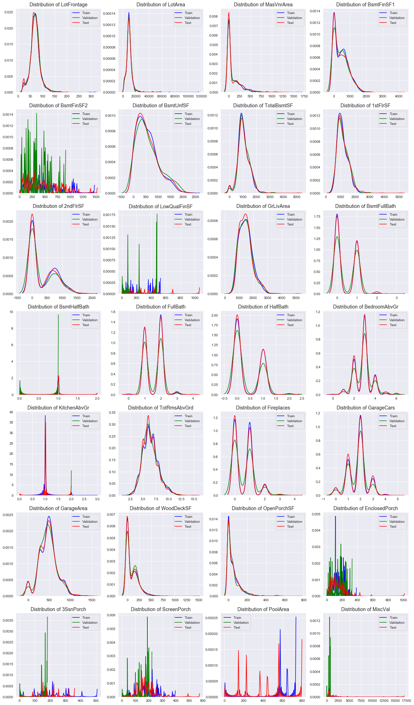
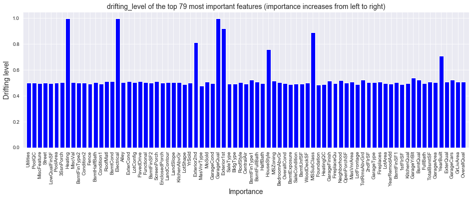

Kaggle’s “House Prices: Advanced Regression Techniques” competition
====
Input:
===
* 1460 training examples and 1459 testing ones (in .csv files)
* 80 input features (38 continuous and 43 categorical). 

Analysis procedure: 
===
1. Clean the data: handle missing data
   * Numerical features:
		- For LotFrontage, missing values are estimated (L2 linear regression) from LotArea

		- Fill 0/None to other missing values
	* Categorical features: Fillna with either 0 or mode 
2. Inspect the data by visualization
3. Preprocess:

	3.1. Remove outliers: using either IsolationForest or normalization (turn on/off for different learning models)
	
	3.2. Handle features having covariate-shift
	
	
	
	
	
	3.3. Remove features that is least 'importance': "Utilities"
				
					Train	Val	    Test
				
		AllPub		1138	285.0	1459.0
	
		NoSeWa		1		NaN	  	NaN
3. Encode categorical labels with value between 0 and number_of_categories-1, handle missing (NA) values, 
4. Use TensorFlow to implement a deep neural network, 
5. Do bias/variance analysis and error analysis. 

Result:
===
All features: use all feature for training with Adam optimzation
= 

With early_stop (terminated at the epoch when validation loss stops decreasing)

